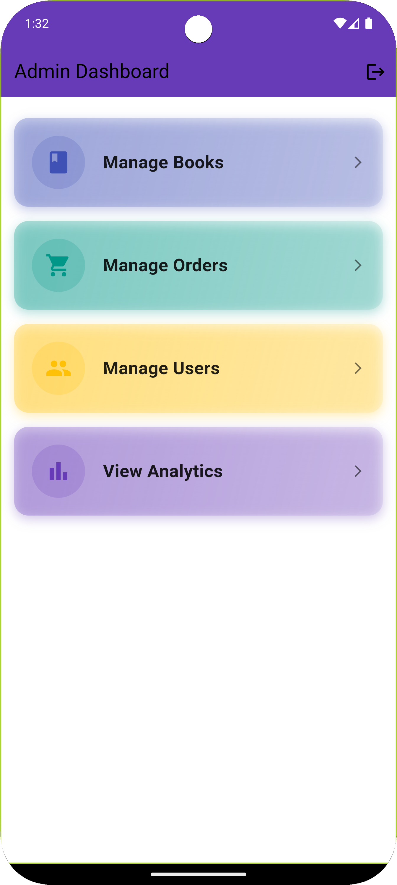
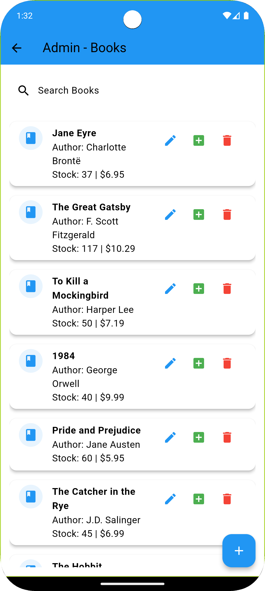
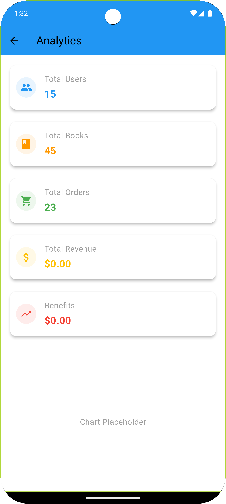
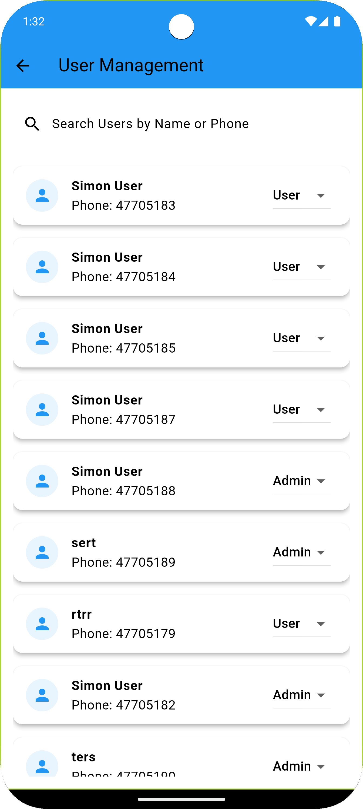
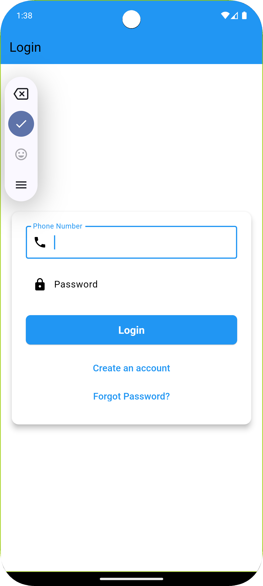
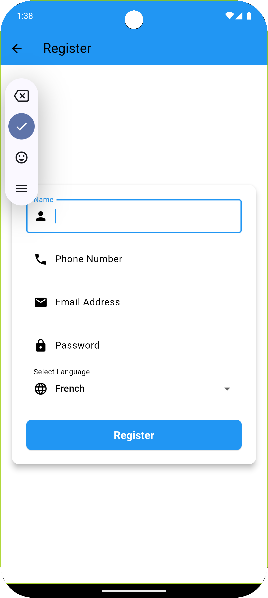
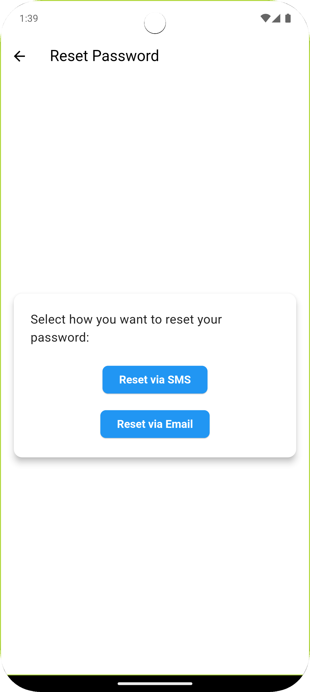
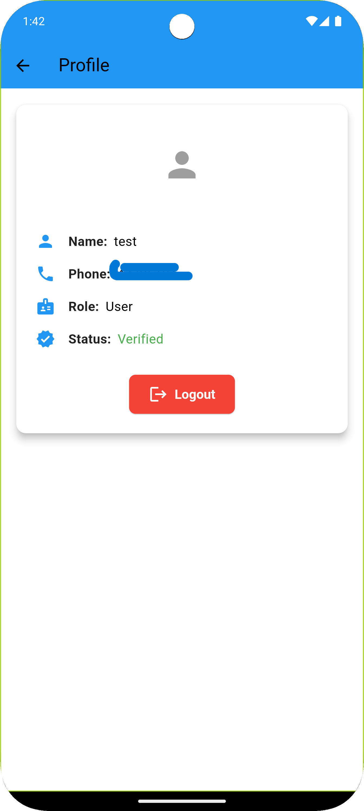
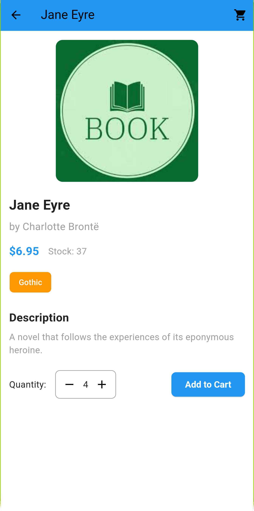
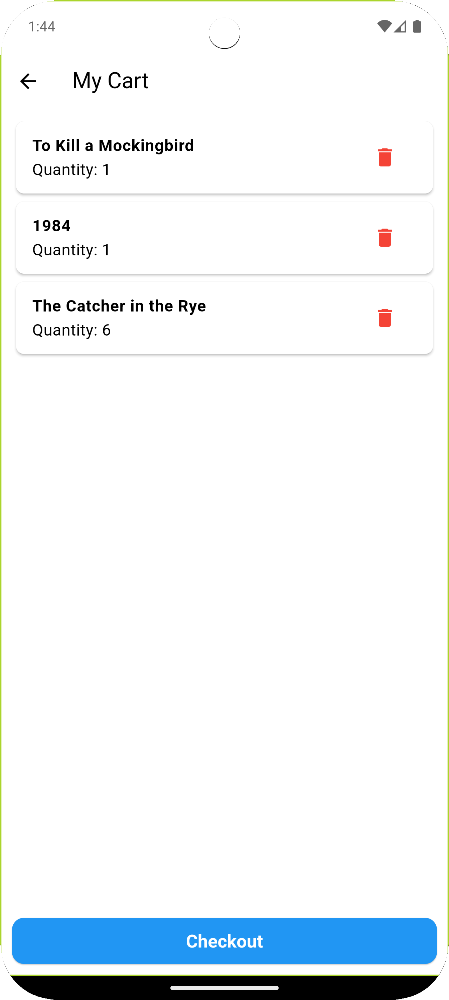

# Flutter  Project

This repository contains a multi-component project with a Flutter frontend, a Python-based core backend, and an SMS microservice work with chingsoft API.

## Repository Structure

```
flutter_git/
├── core_app/        # Python backend application
├── flutter/         # Flutter frontend application
├── smsmic/          # SMS microservice work with chingsoft API
└── photo/           # Screenshots of the Flutter app
```

## Frontend Screenshots

Below are some screenshots of the Flutter application:













